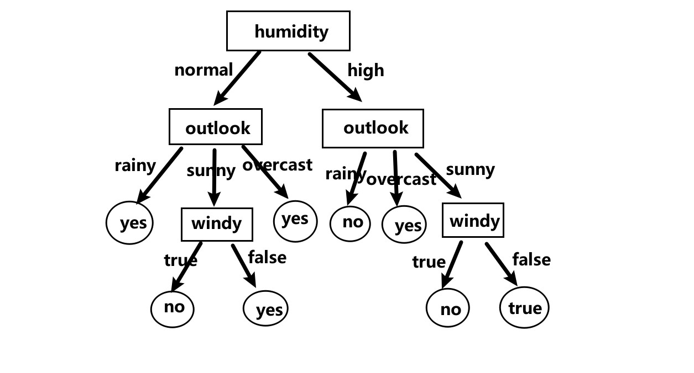

# 决策树
决策树是一种分类算法。它的基本思想是模拟人进行理性判断的过程，即通过不断地问自己问题来得出一个问题的最终答案。每一次问问题都能降低信息的不确定性，当问到最后的信息是确定的时候，就可以停止了。（决策树的终止条件）
当问的问题能最大程度降低信息的不确定性，那么此时问这个问题就是最好的。（决策树的构建）

上面的算法中存在的疑惑是如何衡量信息的不确定性。有两种方法：

1. 使用香农提出的信息熵
2. 使用基尼系数

ID3和C4.5算法使用的是信息熵，CART算法使用的是基尼系数。

## 实验步骤
1. 使用ID3算法，实现对离散型数据的处理、决策树的构建与展示。
2. 根据建立的决策树模型实现对测试数据结果的预测和判断准确率。
3. 推广到连续性样本，以及尝试使用C4.5和CART构建决策树。

> 本实验使用到了Pandas，因为pd对表格型数据的处理比较方便。

## 数据结构的定义

首先是问题中参数的定义。用户必须要输入的参数有特征集X和标签y，可选的参数有是否限定深度——决策树最大的深度和构建决策树时采取的方法。1表示ID3，2表示C4.5，CART算法懒得做了（主要是最开始写的构建树的代码耦合性太高，要改的话需要改太多了，有时间再重构吧）。

```python
class Solution(object):
    def __init__(self, X, y, depth = None, method = 1):
        # @X: 特征
        # @y: 标签
        # @depth: 最大深度
        # @dt: 存储生成的决策树，其中的元素应该是node
        # @method: 计算样本纯度的方法，1表示ID3，2表示C4.5
        self.X = X
        self.y = y
        self.depth = len(X.iloc[0])-1
        self.depth = min(depth-1, self.depth)
        print("最大深度", self.depth+1)
        self.dt = []
        self.pre_y = []
        self.method = method
```

然后是决策树中每一个节点的定义。X，y表示划分到当前节点的特征和标签，ent表示当前节点的信息熵（所以耦合性高啊😂），father表示当前节点的父节点，name表示该节点选择的特征，children表示当前节点的直接子节点。

构建决策树的时候使用双亲表示法，即只知道当前节点的父亲节点是哪个，还不知道子节点有哪些，毕竟还没有算到那里去。只是用双亲表示法是可以表示这棵树的，但是当自顶向下做决策的时候会很麻烦。所以当整棵决策树建好后又遍历了这棵树，将当前节点的所有直接子节点加入children列表中，便于接下来使用决策树分类器模型进行预测。

```python
class node(object):
    def __init__(self, X: pd.DataFrame, y: pd.Series, depth: int, ent=-1, father=None, f_value=None, name=None):
        # @X: 划分到该节点的样本（特征）
        # @y: 划分到该节点的标签
        # @depth: 当前节点的深度，根节点为0
        # @ent: 该节点的信息熵
        # @father: 该节点的父节点，也是node
        # @f_value: 记录父节点到该节点的取值
        # @name: 选择特征的名字
        # @clildren: 如果下一个节点可分的话依然是node，否则就是标签的值
        self.X = X
        self.y = y
        self.ent = ent
        self.depth = depth
        self.values = None
        self.father = father
        self.f_value = f_value
        self.name = name
        if name is not None:
            self.values = X[name].value_counts().index
        self.children = []   
    def __repr__(self):
        return f"{self.name}"
```

## 基本方法

首先是**构建决策树的方法**`fit`。它做的事情就是取出当前节点，然后调用`try_split`静态方法获得当前节点的直接子节点，然后将他们加入`self.dt`中。最后还调用`shape`方法补充每个节点的子节点。

```python
def fit(self):
    # 首先初始化dt，向其中加入根节点
    root = node(self.X, self.y, 0, ent=Solution.entropy(self.y))
    print("DEBUG: 总的信息熵为", root.ent)
    Solution.get_root(root)
    self.dt.append(root)
    # 对于每一个节点，寻找它的下一层节点
    for n in self.dt:
        # print("!DEBUG: try split", n)
        # 终止条件一：如果当前节点的标签都属于一类
        if len(n.y.value_counts())==1: continue
        # 终止条件二：如果特征已经用完或已达到限制的深度
        if n.depth >= self.depth: continue
        # 向其中加入节点
        nodes = Solution.try_split(n, self.method)
        if len(nodes) == 0: continue
        if nodes is not None: self.dt.extend(nodes)
    print(self.dt)
    self.shape()
```

然后是比较重要的`shape`方法了。主要是定义子节点的格式，然后按照这个格式加入相应节点的chileren列表中：

- 如果下一个节点依然是`node`，那么`type`=1：`{'type':1, 'value':value, 'next':self.dt[j]}`
- 如果下一个节点可以获得结果，那么`type`=0：`{'type':0, 'value':value, 'next':group.idxmax()}`

还有就是绘制决策树的方法。严格来说这不算绘制，因为只是在命令行中打印出这棵树的结构：
```
第0层 humidity 的子节点:  [{'type': 1, 'value': 'normal', 'next': outlook}, {'type': 1, 'value': 'high', 'next': outlook}]
第1层 outlook 的子节点:  [{'type': 0, 'value': 'rainy', 'next': 'yes'}, {'type': 1, 'value': 'sunny', 'next': windy}, {'type': 0, 'value': 'overcast', 'next': 'yes'}]
第1层 outlook 的子节点:  [{'type': 0, 'value': 'rainy', 'next': 'no'}, {'type': 0, 'value': 'overcast', 'next': 'yes'}, {'type': 1, 'value': 'sunny', 'next': windy}]
第2层 windy 的子节点:  [{'type': 0, 'value': False, 'next': 'yes'}, {'type': 0, 'value': True, 'next': 'no'}]
第2层 windy 的子节点:  [{'type': 0, 'value': True, 'next': 'no'}, {'type': 0, 'value': False, 'next': 'yes'}]
```
最后在草稿本上可以化出这样一棵树的结构：


接下来是使用决策时进行预测的`predict`方法。它要做的就是对于测试集中的每一行数据，按照决策树进行 查对应特征的值->移动到下一个节点->查特征的值->移动到下个节点->...，一直到`type == 0`，即获得结果为止。

比如使用上面的决策树进行预测，输出为：
```
预测结果:
['no', 'no', 'yes', 'yes', 'yes', 'no', 'yes', 'no', 'yes', 'yes', 'yes', 'yes', 'yes', 'no', 'no', 'no', 'yes', 'yes', 'yes', 'no', 'yes']
准确率为:100.0%
```

## 连续数据离散化
因为实验给的数据是连续的，所以还需要进行离散化。但是这个操作和决策树算法的关系不大，所以我将它放到一个函数里面，没有作为类的方法。

具体的使用就是将连续的特征集传入，对每一个特征，判断它的值是否>4（<=4认为是离散的）。如果认为是连续的，则取样本中该特征的中位数——传入2表示取中位数，传入3表示将连续的样本分为三个区间...

> 分位数的计算使用pandas的`quantile`即可，比较方便。

比如对于这样的连续的数据：
```
X1,X2,X3,X4,y
5.1,3.5,1.4,0.2,1
4.9,3,1.4,0.2,1
4.7,3.2,1.3,0.2,1
4.6,3.1,1.5,0.2,1
...
```

离散化后结果为（这里分了三个区间）：
```
        X1         X2         X3         X4
0   (-inf, 5)  (-inf, 3)  (-inf, 3)  (-inf, 1)
1   (-inf, 5)   (3, inf)  (-inf, 3)  (-inf, 1)
2      (5, 6)   (3, inf)  (-inf, 3)  (-inf, 1)
3      (5, 6)   (3, inf)  (-inf, 3)  (-inf, 1)
4   (-inf, 5)   (3, inf)  (-inf, 3)  (-inf, 1)
...
```

## 使用说明

1. 首先使用pandas读取数据，然后分离出特征和标签。

```python
X = pd.read_csv('./data1/traindata.txt')
y = X.iloc[:, -1]
X = X.drop([X.columns[-1]], axis=1)
```

2. 如果数据是连续的话，还需要进行离散化。

```python
changed = discretization_train(X, cut=3)
```

3. 训练模型，并显示决策树。和`sklearn`的`DecisionTreeClassifier`使用逻辑差不多。

```python
s = Solution(X, y, depth=3, method=1)
s.fit()
s.draw()
```

4. 读取测数集数据，同1和2，然后进行预测并输出准确率。
```python
s.predict(X_test)
s.accurcy(y_test)
```

## 不足
1. 没有剪枝，但是可以通过限定深度防止过拟合。
2. 没有做CART算法。
3. BUG，如果样本太少，决策树的构建不完整。