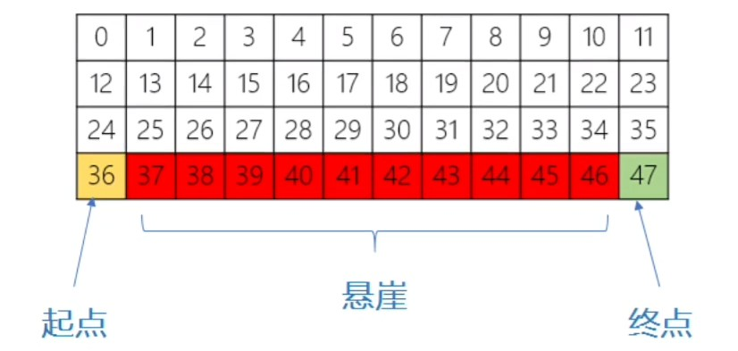

# 使用Qlearning完成悬崖寻路问题


## 探索环境
首先明确环境`cliffWalking`，红色格子表示悬崖，黄色格子表示起点，绿色格子表示终点。


很明显，这是一个网格图，然后又是一个寻路问题，所以很自然就想到了实验1中的A*算法。

输入的网格：
```
[[1, 1, 1, 1, 1, 1, 1, 1, 1, 1, 1, 1], [1, 1, 1, 1, 1, 1, 1, 1, 1, 1, 1, 1],
[1, 1, 1, 1, 1, 1, 1, 1, 1, 1, 1, 1], [1, 0, 0, 0, 0, 0, 0, 0, 0, 0, 0, 1]]
```

用A*求出的最短路径为：
```
[(3, 0), (2, 0), (2, 1), (2, 2), (2, 3), (2, 4), (2, 5), (2, 6), (2, 7), (2, 8), (2, 9), (2, 10), (2, 11), (3, 11)]
```

与肉眼观测相符。

使用A*算法寻路我们站在上帝的角度，知道了环境的整体情况。但是对于强化学习中的智能体，它是不知道的，需要先进行探索，更新Q表格，直到表格收敛或达到规定的训练次数为止。

## 实验方法

简单概括来说，代码的主要逻辑包括学习阶段和预测阶段。

- 学习阶段探索环境，完成Q表格。
- 预测阶段根据已完成的Q表格，选择路径。

## 实验结果

```bash
python main.py
...
Episode:27/30, reward:-13.0
Episode:28/30, reward:-13.0
Episode:29/30, reward:-13.0
Episode:30/30, reward:-13.0
```
最后的奖励为-13，即移动了13步到达终点，也就是之前A*寻到的最短路径。